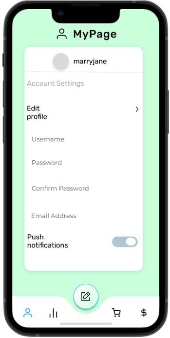
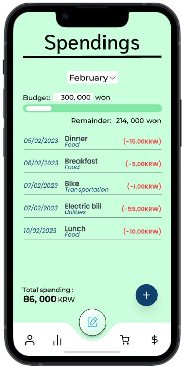
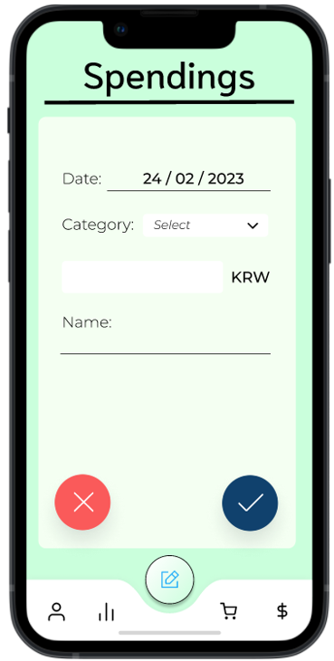
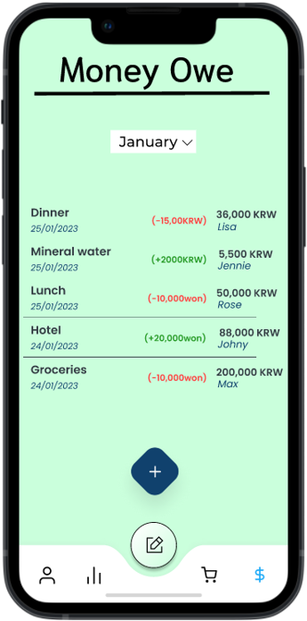
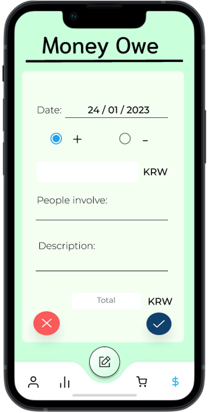

# BudgetKU

Expense Manager Application using Flutter 

Information Architecture 

1. Welcome Page

2. Login Page

3. Sign Up Page

4. My Page

5. My Spending Page

6. My Spending Page (Add)

7. My Expense Page

8. My Debt Page

9. My Debt Page (Add)

